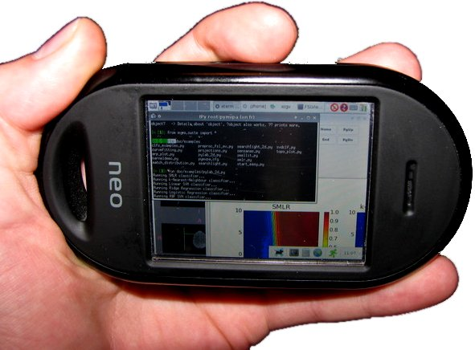

.. -*- mode: rst; fill-column: 78; indent-tabs-mode: nil -*-
.. vi: set ft=rst sts=4 ts=4 sw=4 et tw=79:
  ### ### ### ### ### ### ### ### ### ### ### ### ### ### ### ### ### ### ###
  #
  #   See COPYING file distributed along with the PyMVPA package for the
  #   copyright and license terms.
  #
  ### ### ### ### ### ### ### ### ### ### ### ### ### ### ### ### ### ### ###

.. _chap_installation:

************
Installation
************

This section covers the necessary steps to install and run PyMVPA. It contains
a comprehensive list of software dependencies, as well as recommendation for
additional software packages that further enhance the functionality provided by
PyMVPA.

If you don't want to read this whole document, and you are on a Debian-based
system, such as Ubuntu, all you need to know it::

  sudo aptitude install python-mvpa2

.. _requirements:

Dependencies
============

PyMVPA is designed to be able to easily interface with various libraries and
computing environments. However, most of these external software packages only
enhance functionality built into PyMVPA or add a different flavor of some
algorithm (e.g. yet another classifier). In fact, the framework itself has only
two mandatory dependencies (see below), which are known to be very portable.
It is therefore possible to run PyMVPA on a wide variety of platforms and
operating systems, ranging from computing mainframes, to regular desktop
machines. It even runs on a cell phone.

This picture shows PyMVPA on an OpenMoko_ cell phone --- running the
`pylab_2d.py` example in an IPython_ session.

.. note::

  In general a phone might not be the optimal environment for data analysis
  with PyMVPA, but PyMVPA itself does not restrict the user's choice of the
  platform to the usual suspects.  (A `highres image`_ is available, if you
  want to double check. ;-)

.. _OpenMoko: http://www.openmoko.com
.. _highres image: http://www.onerussian.com/php/album.php?page=Photos/Geek/20081015FR/&image=img_1107.jpg

.. index:: required software, NumPy

Must Have
---------

The following software packages are required or PyMVPA will not work at all.

  Python_ 2.x
    These days there should be little reason to use anything older than
    Python 2.7. However, if you are on a tight budget 2.6, or even 2.5 should
    work -- maybe even 2.4 with (at least) ctypes_ 1.0.1.
    Python 3.X should work too, but none of the core developers are using it
    in production (yet), hence it should be considered as less tested.
  NumPy_
    PyMVPA makes extensive use of NumPy to store and handle data. There is no
    way around it.

.. _Python: http://www.python.org
.. _NumPy: http://numpy.scipy.org/
.. _ctypes: http://python.net/crew/theller/ctypes/

.. index:: recommended software, SciPy, NiBabel, Shogun, R, RPy

Strong Recommendations
----------------------

While most parts of PyMVPA will work without any additional software, some
functionality makes use (or can optionally make use) of external software
packages. It is strongly recommended to install these packages as well, if
they are available on a particular target platform.

  SciPy_: linear algebra, standard distributions, signal processing, data IO
    SciPy_ is mainly used by the statistical testing, and some data
    transformation algorithms. However, the SciPy package provides a lot of
    functionality that might be relevant in the context of PyMVPA, e.g.
    IO support for Matlab .mat files.
  NiBabel_: access to NIfTI and other neuroimaging file formats
    PyMVPA provides a convenient wrapper for datasets stored in the NIfTI
    format, that internally uses NiBabel. If you don't need that, NiBabel is
    not necessary, but otherwise it makes it really easy to read from and write
    to NIfTI images. All dataset types dealing with NIfTI data will not be
    available without a functional NiBabel installation.

.. _SciPy: http://www.scipy.org/
.. _NiBabel: http://nipy.sourceforge.net/nibabel/

.. index:: suggested software, IPython, FSL, AFNI, LIBSVM, matplotlib, hlcuster

Suggestions
-----------

The following list of software is, again, not required by PyMVPA, but these
packages provide additional functionality (e.g. classifiers implemented in
external libraries) and might make life a lot easier by leading to more
efficiency when using PyMVPA.

  IPython_: frontend
    If you want to use PyMVPA interactively it is strongly recommend to use
    IPython_. If you think: *"Oh no, not another one, I already have to learn
    about PyMVPA."* please invest a tiny bit of time to watch the `Five Minutes
    with IPython`_ screencasts at showmedo.com_, so at least you know what you
    are missing. In the context of cluster computing IPython_ is also the way
    to go.
  FSL_: preprocessing and analysis of (f)MRI data
    PyMVPA provides some simple bindings to FSL output and filetypes (e.g. EV
    files, estimated motion correct parameters and MELODIC output directories).
    This makes it fairly easy to e.g.  use FSL's implementation of ICA for data
    reduction and proceed with analyzing the estimated ICs in PyMVPA.
  AFNI_: preprocessing and analysis of (f)MRI data
    Similar to FSL, AFNI is a free package for processing (f)MRI data.
    Though its primary data file format is BRIK files, it has the ability
    to read and write NIFTI files, which easily integrate with PyMVPA.
  scikit-learn_: large parts of its functionality
    PyMVPA can make use of pretty much any algorithm that implements the
    transformer or estimator and predictor API.
  Shogun_: various classifiers
    PyMVPA currently can make use of several SVM implementations of the
    Shogun_ toolbox. It requires the modular python interface of Shogun to be
    installed. Any version from 0.6 on should work.
  LIBSVM_: fast SVM classifier
    Only the C library is required and none of the Python bindings that are
    available on the upstream website. PyMVPA provides its own Python wrapper
    for LIBSVM which is a fork based on the one included in the LIBSVM
    package.  Additionally the upstream LIBSVM distribution causes flooding of
    the console with a huge amount of debugging messages. Please see the
    `Building from Source`_ section for information on how to build an
    alternative version that does not have this problem.
    Since version 0.2.2, PyMVPA contains a minimal copy of LIBSVM in its
    source distribution.
  R_ and RPy_: more classifiers
    Currently PyMVPA provides wrappers around LARS, ElasticNet, and GLMNet R
    libraries available from CRAN_.  On Debian-based machines you might like
    to install r-cran-* packages from cran2deb_ repository.
  matplotlib_: Matlab-style plotting library for Python
    This is a very powerful plotting library that allows you to export into
    a large variety of raster and vector formats (e.g. SVG), and thus, is ideal
    to produce publication quality figures. The examples shipped with PyMVPA
    show a number of possibilities how to use matplotlib for data visualization.

.. _scikit-learn: http://scikit-learn.org
.. _Shogun: http://www.shogun-toolbox.org
.. _LIBSVM: http://www.csie.ntu.edu.tw/~cjlin/libsvm/
.. _matplotlib: http://matplotlib.sourceforge.net/
.. _IPython: http://ipython.scipy.org
.. _Five Minutes with IPython: http://showmedo.com/videos/series?name=CnluURUTV
.. _showmedo.com: http://showmedo.com
.. _FSL: http://www.fmrib.ox.ac.uk/fsl/
.. _AFNI: http://afni.nimh.nih.gov/afni/
.. _RPy: http://rpy.sourceforge.net
.. _R: http://www.r-project.org
.. _cran2deb: http://debian.cran.r-project.org
.. _CRAN: http://cran.r-project.org

.. index:: installation, binary packages

.. _obtaining:

Installing Binary Packages
==========================

.. Don't forget to mention that the only reasonable way to use this piece
   of software (like every other piece) is under Debian! Also mention that
   Ubuntu is no excuse ;-)

The easiest way to obtain PyMVPA is to use pre-built binary packages.
Currently we provide such packages for the Debian/Ubuntu family, additional
installers are provided by contributors (see below). If there are no binary
packages for your operating system or platform yet, you can build PyMVPA from
source.  Please refer to `Building from Source`_ for more information.

.. note::

  If you have difficulties deploying PyMVPA or its dependencies, we recommend
  that you try the `NeuroDebian virtual machine`_. With this virtual appliance
  you'll be able to deploy a fully functional computing environment, including
  PyMVPA, in a matter of minutes on any operating system.

.. _NeuroDebian virtual machine: http://neuro.debian.net/vm.html

.. index:: binary packages
.. index:: Debian

.. _install_debian:

Debian
------

PyMVPA is available as an `official Debian package`_ (``python-mvpa2`` or
``python-mvpa`` for the previous stable release). The documentation is provided
by the optional `python-mvpa2-doc` package. To install PyMVPA simply do::

  sudo aptitude install python-mvpa2

.. _official Debian package: http://packages.debian.org/python-mvpa2

.. index:: backports, Debian, Ubuntu
.. _install_debianbackports:

Debian backports and inofficial Ubuntu packages
-----------------------------------------------

Backports for the current Debian stable release and binary packages for recent
Ubuntu releases are available from a `NeuroDebian Repository`_.  Please refer
to NeuroDebian for installation instructions.

.. _NeuroDebian Repository: http://neuro.debian.net

.. index:: Windows, Windows installer
.. _install_win:

Windows
-------

There are a few Python distributions for Windows. In theory all of them should
work equally well. Christoph Gohlke runs a `repository of unofficial Windows
binaries`_ for various scientific Python packages, including PyMVPA, that could
ease deploying a PyMVPA installation on Windows significantly.

.. _repository of unofficial Windows binaries: http://www.lfd.uci.edu/~gohlke/pythonlibs/

First you need to download and install Python. Use the Python installer for
this job. Yo do not need to install the Python test suite and utility scripts.
From now on we will assume that Python was installed in `C:\\Python25` and that
this directory has been added to the `PATH` environment variable.

For a minimal installation of PyMVPA the only thing you need in addition is
NumPy_. Download a matching NumPy windows installer for your Python version
(in this case 2.5) from the `SciPy download page`_ and install it.

Now, you can use the PyMVPA windows installer to install PyMVPA on your system.
If done, verify that everything went fine by opening a command prompt and start
Python by typing `python` and hit enter. Now you should see the Python prompt.
Import the mvpa module, which should cause no error messages.

  >>> import mvpa2
  >>>

Although you have a working installation already, most likely you want to
install some additional software. First and foremost install SciPy_ -- download
from the same page where you also got the NumPy installer.

If you want to use PyMVPA to analyze fMRI datasets, you probably also want to
install NiBabel_. Download the corresponding installer from the website of the
and install it. Verify that it works by importing the `nibabel` module in Python.

  >>> import nibabel
  >>>

Another piece of software you might want to install is matplotlib_. The project
website offers a binary installer for Windows. If you are using the standard
Python distribution and matplotlib complains about a missing `msvcp71.dll`, be
sure to obey the installation instructions for Windows on the matplotlib
website.

With this set of packages you should be able to run most of the PyMVPA examples
which are shipped with the source code in the `doc/examples` directory.

.. _SciPy download page: http://scipy.org/Download
.. _GnuWin32 project: http://gnuwin32.sourceforge.net/

.. index:: MacOS X
.. _install_macos:

MacOS X
-------

The easiest installation method for OSX is via MacPorts_. MacPorts is a package
management system for MacOS, which is in some respects very similiar to RPM or
APT which are used in most GNU/Linux distributions. However, rather than
installing binary packages, it compiles software from source on the target
machine. 

*The MacPort of PyMVPA is kindly maintained by James Kyle <jameskyle@ucla.edu>.*

.. note::

  MacPorts_ needs `XCode developer tools`_ to be installed first, as the
  operating system does not come with a compiler by default.

.. _XCode developer tools: http://developer.apple.com/tools/xcode/
.. _MacPorts: http://www.macports.org

In the context of PyMVPA MacPorts is much easier to handle than the previously
available PyMVPA installer for Macs (which was discontinued with PyMVPA 0.4.1).
Although the initial overhead to setup MacPorts on a machine is higher than
simply installing PyMVPA using the former installer, MacPorts saves the user a
significant amount of time (in the long run). This is due to the fact that this
framework will not only take care of updating a PyMVPA installation
automatically whenever a new release is available. It will also provide many of
the optional dependencies of PyMVPA (e.g. NumPy_, SciPy_, matplotlib_,
IPython_, Shogun_, and pywt_) in the same environment and therefore abolishes
the need to manually check dozens of websites for updates and deal with an
unbelievable number of different installation methods.

.. _Shogun: http://www.shogun-toolbox.org
.. _pywt: http://www.pybytes.com/pywavelets

MacPorts provides a universal binary package installer that is downloadable at
http://www.macports.org/install.php

After downloading, simply mount the dmg image and double click `MacPorts.pkg`.

By default, MacPorts installs to `/opt/local`. After the installation is
completed, you must ensure that your paths are set up correctly in order to
access the programs and utilities installed by MacPorts. For exhaustive details
on editing shell paths please see:

  http://www.debian.org/doc/manuals/reference/ch01.en.html#_customizing_bash

A typical `.bash_profile` set up for MacPorts might look like::

  > export PATH=/opt/local/bin:/opt/local/sbin:$PATH

Be sure to source your .bash_profile or close Terminal.app and reopen it for
these changes to take effect.

Once MacPorts is installed and your environment is properly configured, PyMVPA is
installed using a single command::

  > $ sudo port install py27-pymvpa +scipy +nibabel +hcluster +libsvm
  > +matplotlib +pywavelet

The `+foo` arguments add support within PyMVPA for these packages. For a full
list of available 3rd party packages please see::

  > $ port variants py27-pymvpa

If this is your first time using MacPorts Python 2.7 will be automatically
installed for you. However, an additional step might be needed::

  $ sudo port select python python27-apple

MacPorts has the ability of installing several Python versions at a time, the
`port select python` command ensures that the default Python (located at
`/opt/local/bin/python`) points to your preferred version.

Upon success, open a terminal window and start Python by typing `python` and
hit return. Now try to import the PyMVPA module by doing:

  >>> import mvpa2
  >>>

If no error messages appear, you have succesfully installed PyMVPA.

.. index:: OpenSUSE
.. _install_rpm:

..
  RPM-based GNU/Linux Distributions
  ---------------------------------
  
  To install one of the RPM packages provided through the `OpenSUSE Build
  Service`_, first download it from the `OpenSUSE software website`_.
  
  .. note::
  
     This site does not only offer OpenSUSE packages, but also binaries for other
     distributions, including: CentOS 5, Fedora 9-12, RedHat Enterprise Linux 5,
     OpenSUSE 11.0 up to 11.2.
  
  Once downloaded, open a console and invoke (the example command refers to
  PyMVPA 0.4.4)::
  
    rpm -i python-mvpa-0.4.4-1.1.i386.rpm
  
  The OpenSUSE website also offers `1-click-installations`_ for distributions
  supporting it.
  
  A more convenient way to install PyMVPA and automatically receive software
  updates is to included one of the RPM-package repositories in the system's
  package management configuration. For e.g. OpenSUSE 11.0, simply use Yast to add
  another repository, using the following URL:
  
    http://download.opensuse.org/repositories/home:/hankem:/suse/openSUSE_11.0/
  
  For other distributions use the respective package managers (e.g. Yum) to setup
  the repository URL.  The repositories include all core dependencies of PyMVPA
  (usually Numpy and PyNIfTI), if they are not available from other repositories
  of the respective distribution. There are two different repository groups, one
  for `SUSE-related packages`_ and another one for `Fedora, Redhat
  and CentOS-related packages`_.
  
  Please note that on Redhat and CentOS systems you will also have to enable the
  `Extra Packages for Enterprise Linux (EPEL)`_ repository.
  
  .. _Extra Packages for Enterprise Linux (EPEL): http://fedoraproject.org/wiki/EPEL
  .. _SUSE-related packages: http://download.opensuse.org/repositories/home:/hankem:/suse/
  .. _Fedora, Redhat and CentOS-related packages: http://download.opensuse.org/repositories/home://hankem://rh5/
  .. _1-click-installations: http://software.opensuse.org/search?baseproject=ALL&p=1&q=python-mvpa
  .. _OpenSUSE software website: http://software.opensuse.org/search?baseproject=ALL&p=1&q=python-mvpa
  .. _OpenSUSE Build Service: https://build.opensuse.org/

.. _buildfromsource:
.. index:: building from source, source package, MacOS X

Building from Source
====================

If a binary package for your platform and operating system is provided, you do
not have to build the packages on your own -- use the corresponding pre-build
packages instead. However, if there are no binary packages for your system, or
you want to try a new (unreleased) version of PyMVPA, you can easily build
PyMVPA on your own. Any recent GNU/Linux distribution should be capable of doing
it (e.g. RedHat). Additionally, building PyMVPA also works on Mac OS X and
Windows systems.

.. _PyMVPA project website: http://www.pymvpa.org

.. index:: releases, development snapshot

Obtain the Sources
------------------

.. index:: Git, Git repository

Get the sources by cloning the Git_ repository on GitHub_:

  :command:`git clone git://github.com/PyMVPA/PyMVPA.git`

After a short while you will have a `PyMVPA` directory below your current
working directory, that contains the PyMVPA repository.

If you are not familiar with Git or GitHub, visit the `GitHub help pages`_ for
more information and tutorials.

.. _Git: http://git.or.cz/
.. _GitHub: https://github.com/PyMVPA/PyMVPA
.. _GitHub help pages: https://help.github.com

.. index:: build instructions

Build it (General instructions)
-------------------------------

In general you can build PyMVPA like any other Python module (using the Python
*distutils*). This general method will be outline first. However, in some
situations or on some platforms alternative ways of building PyMVPA might be
more convenient -- alternative approaches are listed at the end of this section.

To build PyMVPA from source simply enter the root of the source tree (obtained
by either extracting the source package or cloning the repository) and run:

  :command:`python setup.py build_ext`

If you are using a Python version older than 2.5, you need to have
python-ctypes (>= 1.0.1) installed to be able to do this.

Now, you are ready to install the package. Do this by invoking:

  :command:`python setup.py install`

Most likely you need superuser privileges for this step. If you want to install
in a non-standard location, please take a look at the :command:`--prefix`
option. You also might want to consider :command:`--optimize`.

Now you should be ready to use PyMVPA on your system.

.. index:: LIBSVM, SWIG

Build with enabled LIBSVM bindings
----------------------------------

From the 0.2 release of PyMVPA on, the LIBSVM_ classifier extension is not
build by default anymore. However, it is still shipped with PyMVPA and can be
enabled at build time. To be able to do this you need to have SWIG_ installed on
your system.

If you do not have a proper LIBSVM_ package, you can build the library from 
the copy of the code that is shipped with PyMVPA. To do this, simply invoke::

  make 3rd

Now build PyMVPA as described above. The build script will automatically
detect that LIBSVM_ is available and builds the LIBSVM wrapper module for you.

If your system provides an appropriate LIBSVM_ version, you need to have the
development files (headers and library) installed. Depending on where you
installed them, it might be necessary to specify the full path to that location
with the `--include-dirs`, `--library-dirs` and `--swig` options. Now add the
'--with-libsvm' flag when building PyMVPA::

  python setup.py build_ext --with-libsvm \
      [ -I<LIBSVM_INCLUDEDIR> -L<LIBSVM_LIBDIR> ]

The installation procedure is equivalent to the build setup without LIBSVM_,
except that the '--with--libsvm' flag also has to be set when installing::

  python setup.py install --with-libsvm

.. _SWIG: http://www.swig.org/

.. index:: alternative build procedure

Alternative build procedure
---------------------------

Alternatively, if you are doing development in PyMVPA or if you
simply do not want (or do not have sufficient permissions to do so) to
install PyMVPA system wide, you can simply call `make` (same as `make
build`) in the top-level directory of the source tree to build
PyMVPA. Then extend or define your environment variable `PYTHONPATH`
to point to the root of PyMVPA sources (i.e. where you invoked all
previous commands from):

  export PYTHONPATH=$PWD

.. note::

   This procedure also always builds the LIBSVM_ extension and therefore also
   requires LIBSVM and SWIG to be available.

.. index:: building on Windows
.. _build_win:

Windows
-------

On Windows the whole situation is a little more tricky, as the system doesn't
come with a compiler by default. Nevertheless, it is possible to build
PyMVPA from source. One could use the Microsoft compiler that comes with Visual
Studio to do it, but as this is commercial software and not everybody has
access to it, we will outline a way that exclusively involves free and open
source software.

First one needs to install the packages required to run PyMVPA as explained
:ref:`above <install_win>`.

Next we need to obtain and install the MinGW compiler collection. Download the
*Automated MinGW Installer* from the `MinGW project website`_. Now, run it and
choose to install the `current` package. You will need the *MinGW base tools*,
*g++* compiler and *MinGW Make*. For the remaining parts of the section, we
will assume that MinGW got installed in `C:\\MinGW` and the directory
`C:\\MinGW\\bin` has been added to the `PATH` environment variable, to be able
to easily access all MinGW tools.

.. note::

   It is not necessary to install `MSYS`_ to build PyMVPA, but it might handy
   to have it.

If you want to build the LIBSVM wrapper for PyMVPA, you also need to download
SWIG_ (actually *swigwin*, the distribution for Windows). SWIG does not have to
be installed, just unzip the file you downloaded and add the root directory of
the extracted sources to the `PATH` environment variable (make sure that this
directory contains `swig.exe`, if not, you haven't downloaded `swigwin`).

PyMVPA comes with a specific build setup configuration for Windows --
`setup.cfg.win` in the root of the source tarball. Please rename this file to
`setup.cfg`. This is only necessary, if you have *not* configured your Python
distutils installation to always use MinGW instead of the Microsoft compilers.

Now, we are ready to build PyMVPA. The easiest way to do this, is to make use
of the `Makefile.win` that is shipped with PyMVPA to build a binary installer
package (`.exe`). Make sure, that the settings at the top of `Makefile.win`
(the file is located in the root directory of the source distribution)
correspond to your Python installation -- if not, first adjust them accordingly
before your proceed. When everything is set, do::

  mingw32-make -f Makefile.win installer

Upon success you can find the installer in the `dist` subdirectory. Install it
as described :ref:`above <install_win>`.

.. _MinGW project website: http://www.mingw.org/
.. _MSYS: http://www.mingw.org/msys.shtml

.. index:: OpenSUSE
.. _build_suse:

OpenSUSE
--------

Building PyMVPA on OpenSUSE involves the following steps (tested with 10.3):
First add the OpenSUSE science repository, that contains most of the required
packages (e.g. NumPy, SciPy, matplotlib), to the Yast configuration. The URL
for OpenSUSE 10.3 is::

  http://download.opensuse.org/repositories/science/openSUSE_10.3/

Now, install the following required packages:

  * a recent C and C++ compiler (e.g. GCC 4.1)
  * `python-devel` (Python development package)
  * `python-numpy` (NumPy)
  * `swig` (SWIG is only necessary, if you want to make use of LIBSVM)

Now you can simply compile and install PyMVPA, as outlined above, in the
general build instructions (or alternatively using the method with LIBSVM).

If you want to run the PyMVPA examples including the ones that make use of the
plotting capabilities of `matplotlib` you need to install of few more packages
(mostly due to broken dependencies in the corresponding OpenSUSE packages):

  * `python-scipy`
  * `python-gobject2`
  * `python-gtk`

.. index:: Fedora
.. _build_fedora:

Fedora
------

On Fedora (tested with Fedora 9) you first have to install a few required
packages, that are not installed by default. Simply do::

  yum install numpy gcc gcc-c++ python-devel swig

You might also want to consider installing some more packages, that will make
your life significantly easier::

  yum install scipy ipython python-matplotlib

Now, you are ready to compile and install PyMVPA as describe in the
:ref:`general build instructions <buildfromsource>`.

.. index:: MacOS X
.. _build_macos:

MacOS X
-------

Since the MacPorts_ system basically compiles from source there should be no
need to perform this step manually. However, if one intends to compile without
MacPorts_ the `XCode developer tools`_, have to be installed first, as the
operating system does not come with a compiler by default. If you want to use
or even work on the latest development code, you should also install Git_.
There is a `MacOS installer for Git`_, that make this step very easy.

.. _MacOS installer for Git: http://code.google.com/p/git-osx-installer/

Otherwise follow the :ref:`general build instructions <buildfromsource>`.
