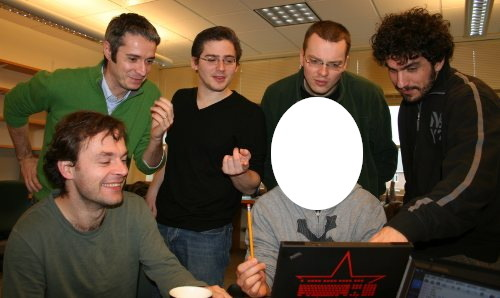

.. -*- mode: rst; fill-column: 78; indent-tabs-mode: nil -*-
.. vi: set ft=rst sts=4 ts=4 sw=4 et tw=79:
  ### ### ### ### ### ### ### ### ### ### ### ### ### ### ### ### ### ### ###
  #
  #   See COPYING file distributed along with the PyMVPA package for the
  #   copyright and license terms.
  #
  ### ### ### ### ### ### ### ### ### ### ### ### ### ### ### ### ### ### ###

.. _chap_workshop_2009fall:

********************************
PyMVPA Extravaganza -- Fall 2009
********************************

This development workshop took place at Dartmouth College, Nov 30 -- Dec
4, 2009.

Goals
=====

The primary purpose of this first PyMVPA workshop was to gather all people
involved in (or related to) the development of PyMVPA. Participants introduced
their projects and discussed their integration into, or interoperation with the
PyMVPA main line.

In addition, we discussed changes scheduled for the upcoming 0.5 release of
PyMVPA that are supposed to improve shortcomings of the original design, or
missing features that have been identified over the past two years. These
include:

* More flexible data storage: A new dataset implementation.
* Better integration of PyMVPA and MDP_.
* Establishing an optimization framework within PyMVPA.
* Various performance improvements, e.g. kernel-caching, parallelization,
  potential of CUDA.

.. _MDP: http://mdp-toolkit.sourceforge.net/

Participants
============

* Satrajit Ghosh, MIT, USA (for the kick-off talks)
* Scott Gorlin, MIT, USA
* Valentin Haenel, BCCN, Germany
* Yaroslav O. Halchenko, Dartmouth College, USA
* Michael Hanke, Dartmouth College, USA
* Emanuele Olivetti, Fondazione Bruno Kessler, Italy
* Per B. Sederberg, Princeton University, USA (virtual)
* Tiziano Zito, BCCN, Germany

Kick-off Talks
==============

The workshop started on *Monday Nov 30th at 9:30am* with a series of talks
covering the various aspects of the workshop (abstracts below).

PyMVPA: Where we are now, and where we are going
------------------------------------------------

Yaroslav O. Halchenko, Michael Hanke

This talk will give a brief summary of our original concept of PyMVPA that we
had in mind when designing it two years ago, and how the project evolved since
then.  We will touch upon several issues we had to face concerning development,
quality assurance, and deployment. While the latest PyMVPA release offers a wide
array of tools and algorithms, we also identified a number of problems that
limit further integration of novel techniques into the framework. The talk will
conclude with an outline how we believe these issues can be resolved and
introduces a number of improvements that will become available with the next
milestone release: PyMVPA **0.5**.

MDP inside out
--------------

Tiziano Zito

MDP is a Python collection of machine learning algorithms and a framework
for implementing new algorithms and combining them into data processing
workflows. MDP has been designed around two main ideas: expose a simple
API, to allow scientific users to use it as a standalone library, and
organize the internal structure of the objects to encourage developers to
extend it and embed it in other libraries such as PyMVPA. In my talk, I
will use MDP as a starting point to hash over some basic principles of
scientific software design. I will discuss the criteria that inform the
design of MDP and their specific implementation, and examine their
advantages, limitations and possible alternatives. I will conclude with a
summary of the current status and future plans for MDP development.

Nipype - A Python framework for neuroimaging
--------------------------------------------

Satrajit Ghosh

Nipype is a project under the umbrella of Nipy, an effort to develop
open-source, community-developed neuroimaging tools in Python.  The goals of
Nipype are two-fold: 1) to provide a uniform interface to existing
neuroimaging software packages; and 2) to provide a pipelined environment
for efficient batch-processing that can tie together different neuroimaging
data analysis algorithms. By exposing a consistent interface to the external
packages, researchers are able to explore a wide range of imaging algorithms
and configure their own analysis pipeline which best fits their data and
research objectives, and perform their analysis in a highly structured
environment. The nipype framework is accessible to the wide range of
programming expertise often found in neuroimaging, allowing for both
easy-to-use high-level scripting and low-level algorithm development for
unlimited customization.

Profiling PyMVPA
----------------

Valentin Haenel

In this talk I will present the work we did to compare the PyMVPA and Matlab
implementations of the searchlight algorithm. This will include a description
of how we iteratively discovered various bottlenecks and the steps taken to
eliminate these. In particular, I will first present modifications of the
source code and then show the resulting change in profiler output. I may
conclude with some ideas for future work and some additional remarks about
optimization in general.

Supervised Tract Segmentation
-----------------------------

Emanuele Olivetti

Automatic segmentation of tractography data into pathways/tracts is a
problem traditionally addressed by means of unsupervised techniques,
i.e., clustering streamlines. The core of this work is to adopt
instead a supervised approach, learning from the segmentation made by
an expert neuroanatomist in order to predict tracts in new brains.

In this talk a novel set of supervised approaches to the tract
segmentation problem will be illustrated. The proposed solutions are
based on machine learning topics like "supervised clustering",
"learning with similarity functions" and "transduction". These
solutions allow to exploit both diffusion and functional MRI data, to
avoid co-registration between different subjects and to predict tracts
in hemispheres different from the training example. Preliminary
results support these claims.

An intended goal of this talk is to open a discussion on how to map
the building blocks of the proposed methods into the PyMVPA framework
in order to support tractography data analysis natively and, more in
general, to provide novel machine learning approaches to the users.

Caching kernels
---------------

Scott Gorlin

A major bottleneck in a standard classification analysis relies on
calculating the dot product between vectors in high-dimensional space.
This is especially time consuming when there are few samples but the
number of dimensions is high, such as the case of fMRI data.  In fact,
many common analysis techniques such as cross validation, bootstrapping,
and model selection require that the kernel be recalculated for each
permutation, even if that exact calculation has been done before.  This
presentation analyzes the problem inherent in a high-level library such
as PyMVPA and illustrates one example of how to cache and reuse kernels,
greatly simplifying the underlying computations and accelerating many
analytical technique implementations by several orders of magnitude.

Workshop Results
================

The workshop has been a huge success. We worked on further integrating PyMVPA
with other Python-based software packages, both to make use of them inside
PyMVPA, but also to better expose PyMVPA's functionality to other packages.
The kick-off talks were followed by four days of intensive coding. During these
days we were able to integrate virtually all outstanding patches that have been
offered over the last year, but could not be merged yet due to required changes
in the codebase. Below is a list of projects that we have been working on
during the workshop.  Moreover, we were able to continue the transition towards
the new dataset implementation that had been started prior to the workshop. A
significant number of additional unittest has been ported to the new code -- as
usual identifying and fixing a number of bugs.

  Workshop participants (from left to right and top to bottom): Emanuele
  Olivetti, Scott Gorlin, Michael Hanke, Tiziano Zito, Yaroslav O.
  Halchenko, Valentin Haenel

Grand Kernel Unification
------------------------

Scott Gorlin, Yaroslav O. Halchenko, and Emanuele Olivetti

Many core MVPA algorithms rely on expensive kernel computations.  However,
most of these algorithms have their own naming standards and backend 
implementations which are not interchangeable, meaning that new advances in
kernel logic or software implementations are not generally beneficial to PyMVPA
as a whole.  To solve this, we have implemented a new class hierarchy which not
only specifies a standard kernel interface, but also allows the automatic
translation of kernels from one software backend to another.

Specifically, it is now possible to specify new kernel classes in pure Python 
(or any method which can expose a Numpy array, such as PyCUDA or custom C) and
automatically convert these back and forth to Shogun kernels.  This has the
immediate advantage of allowing custom kernels for any Shogun-based classifier
(e.g. SVM), using Shogun kernels for fast computation in any other solver (e.g.,
GPR), or the automatic exchange of kernels for any implementation in the future.

Cached Kernel Optimization
--------------------------

Scott Gorlin, Yaroslav O. Halchenko

The main benefit of the kernel unification work is that new kernel classes can
be specified in pure Python.  A new optimized kernel class we have implemented
is a CachedKernel which can automatically cache and reuse kernel matrices from
any other NumpyKernel (or any kernel which is convertible to Numpy, such as a
Shogun kernel).  This class will prove extremely useful for techniques such as
cross-validation, bootstrapping, etc, where the kernel product is normally
recalculated every time it is computed - e.g., every time SVM.train(...) is
called.  Caching the kernel will avoid these expensive computations and greatly
speed up this type of analysis by several orders of magnitude.

Flexible, straightforward adaptor for arbitrary MDP nodes and flows
-------------------------------------------------------------------

Michael Hanke, Tiziano Zito

Although previously PyMVPA used MDP to provide a subset of its functionality
through Mappers, this was limited to single nodes (e.g. PCA, ICA) and was not
meant to be extended by users (except for subclassing and writing a new node
wrapper by hand).  Now, PyMVPA included flexible adaptors for arbitrary MDP
nodes, or whole MDP flows. Besides incremental training, these adaptors offer
access to the full functionality of the underlying node or flow.
Straightforward (single-line of code) wrapping allows to seamlessly blend MDP
into PyMVPA.

The benefits are two-fold: PyMVPA users have now access to the full
functionality of MDP without having to develop custom mappers. This includes
algorithms, such as PCA, ICA, factor analysis, discriminant analysis, slow
feature analysis, or restricted Boltzmann machines, and many more. MDP users
can now use PyMVPA to perform convenient cross-validation of classification
procedures with arbitrary mixes of PyMVPA classifiers and measure and MDP nodes,
and flows.

Non-matrix Dataset and prototype mapper for tractography data (and more!)
-------------------------------------------------------------------------

Emanuele Olivetti, Michael Hanke

The vast majority of algorithms available (and desirable) in PyMVPA requires
data in a 2D matrix format. For this reason, until now, PyMVPA accepted only 2D
matrices as samples in a Dataset. However, sometimes this causes problems, for
example, with tractography data. That consists of a set of streamlines, a
streamline being a polyline made of a non-constant number of points. In PyMVPA
terms it means that the number of features in the corresponding dataset of
streamlines would be different across instances.

The purpose of a set of patches made during the workshop is twofold: first to
allow PyMVPA to accept also row-wise iterable collections as a Dataset
independently of the content of each row and second to provide a mapper to
transform these every kind of Dataset into 2D matrix Dataset. The mapper is
prototype-based which means that each instance within the Dataset (e.g., each
streamline) is mapped into a fixed size M-dimensional vector. The M values are
computed by specifying a similarity (or kernel, or distance) function which
evaluates the distance of that instance against a given set of other M
instances (e.g., other M streamlines) called *prototypes*. An example
application is supervised tract segmentation from tractography data which now
can be mapped into a standard binary classification problem over the usual 2D
matrix class-labeled dataset. This approach to adress varying features-space
sizes is flexible, and not limited to the tractography domain.

Optimization and Generalization of Searchlight-analyses
-------------------------------------------------------

Valentin Haenel, Michael Hanke

The searchlight analysis code has been ported to the new dataset/mapper
framework, taking into account the result of a profiling analysis done by
Valentin Haenel during the last year. The new code avoids significant
look-up penalties of the previous implementation. Moreover, it has been
generalized to support arbitrary look-up algorithms (e.g. kd-tree_) and is no
longer limited to sphere-based spatial searchlights.

.. _kd-tree: http://en.wikipedia.org/wiki/Kd-tree

Acknowledgements
================

We are grateful to Prof. James Haxby for sponsoring this workshop and hosting
it in his lab.
